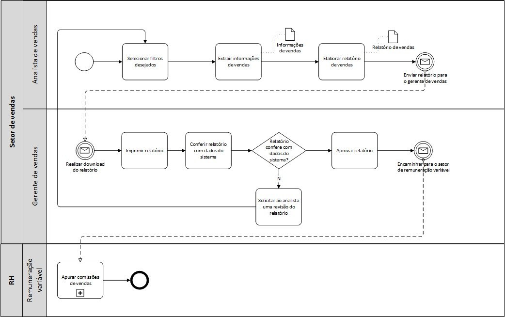
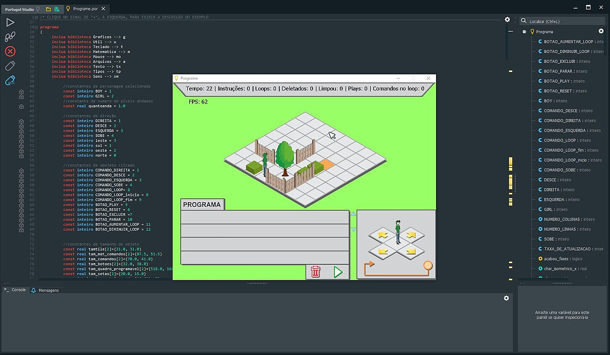

<h1>PORTUGAL</h1>

<i>"O Portugol Studio é um ambiente para aprender a programar, voltado para os iniciantes em programação que falam o idioma português. Possui uma sintaxe fácil, diversos exemplos e materiais de apoio à aprendizagem. Também possibilita a criação de jogos e outras aplicações." (lite.acad.univali.br)</i>

Programar é entender e resolver objetivos por softwares, de lógica coerente do raciocínio das ideias.  

<ul>
	<li><b>Metacognição</b> - Estrutura para entender o pensar como você pensa;</li>
	<li><b>Abstração</b> - Concentração de aspectos, ignorando características de menor geração de valor ao produto;</li>
</ul>  

 

<b>Fluxograma</b> - Diagrama de representação do Algoritmo esquemático de um processo (passo-a-passo) com lógica, coerência e de flxo de dados.

 

Apresentação do dashboard da IDE:

Fonte: <a href="https://pt.wikipedia.org/wiki/Portugol_Studio#/media/Ficheiro:Tela_Portugol.jpg">clique aqui.</a>

 
<h2>Sobre...</h2>

Desenvolvimento de questões de lógica pelo:  
Link do Portugol: https://github.com/UNIVALI-LITE/Portugol-Studio

 
<h2>Por que?</h2>

O Pseudocódigo é uma forma genérica de escrever algoritmo, simples que o escreve de forma a ser entendida por qualquer pesso.  
"Em posteriori", escreva de forma específica num conjunto de instruções e regras usadas para gerar projetos em Linguagem de Programação como meio de comunicação entre máquina e humanos.

Por RYAN CASTRO FERREIRA, 
<b style="color: blue;">LinkdIn </b>- https://www.linkedin.com/in/ryan-castro-ferreira/  
<b style="color: red;">Email </b>- ryancasf@gmail.com  